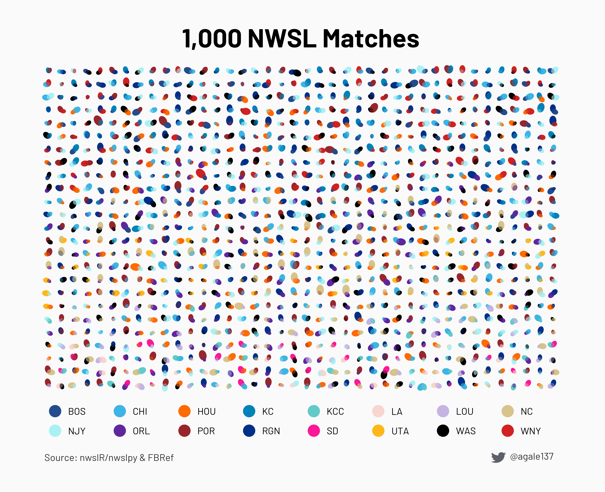
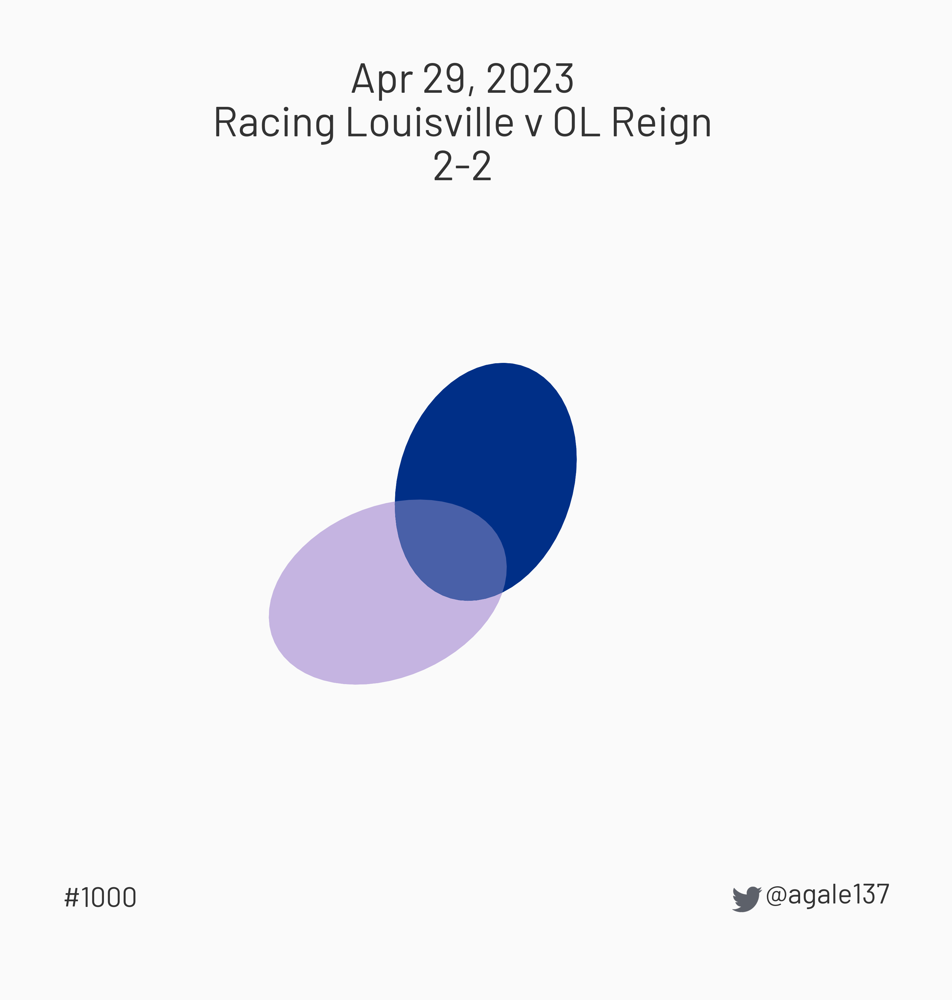

# 1,000 NWSL Matches

The Racing Louisville v OL Reign game on April 29, 2023 marked the 1,000th
regular season NWSL game. This was my first attempt at generative art,
using data from all 1,000 matches. Teams are represented by ovals that are
oriented and sized to represent goals scored and season performance.

I made this image as a legend to explain how individual matches are rendered:

Here is the first NWSL match:

And here is match 1,000:

