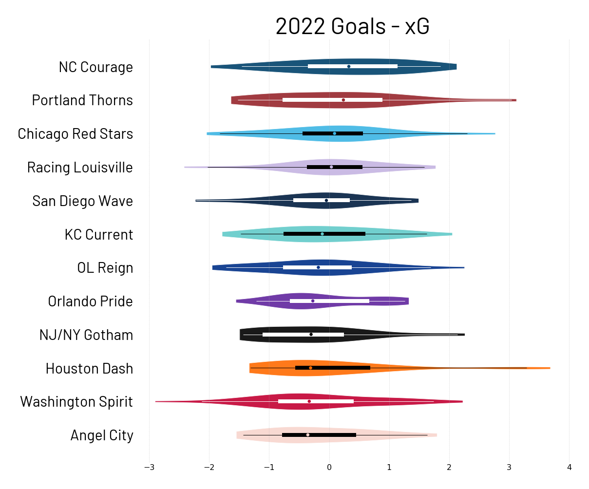
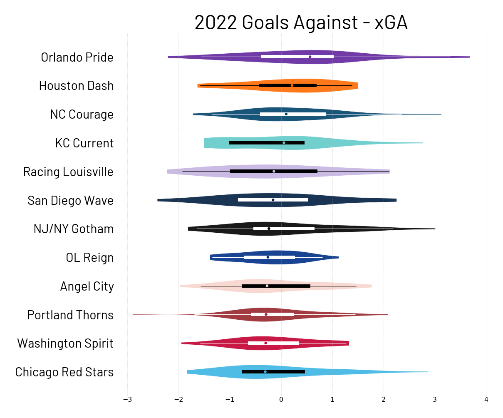

# ASA

This is a set of scripts and visualizations using the itscalledsoccer Python library from American Soccer Analysis.

## xG - G

This shows the distribution of differences between xG and G for each team in the NWSL.

## xGA - GA

This shows the distribution of differences between xGA and GA for each team in the NWSL.

