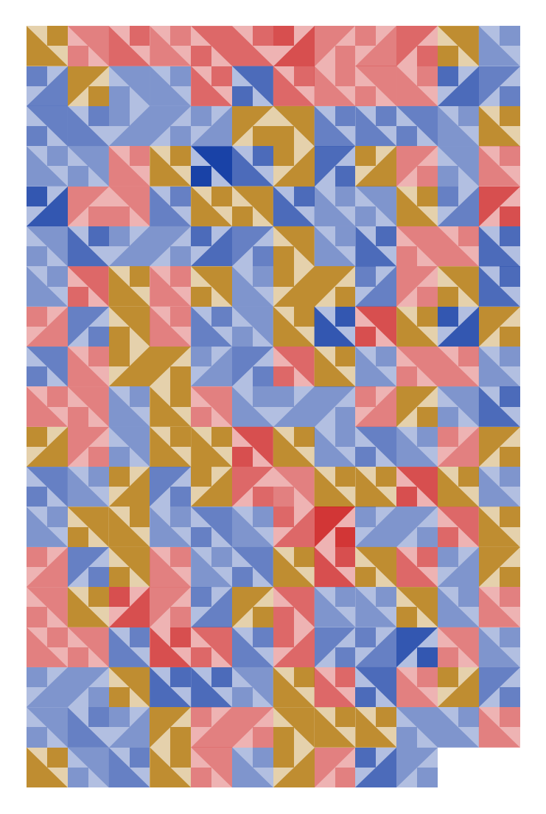
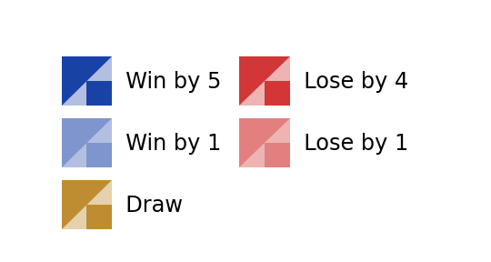

# Reign Quilt

I wanted to use quilt patterns to encode soccer data and I decided to use the
results of all Reign games (regular season, playoffs, challenge cup, and fall
series). Blue represents wins, red represents losses, and gold are ties. The
greater the margin of victory or defeat, the stronger the contrast between the
two colors.

Here are examples of how games would be encoded:

