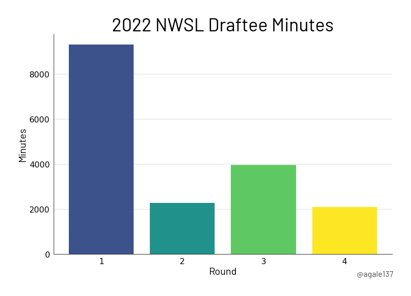
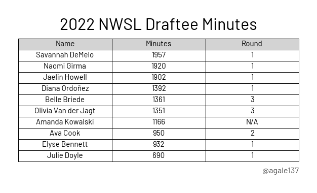

# Draft Analysis

The goal is to look at the minutes played by players who entered the 2022 NWSL draft. The first plot is a Sankey that shows NCAA conferences and NWSL teams to see how many minutes are attributed to both.

Next I looked at how many minutes were played by players selected in each round of the draft.

Finally I made a simple table that shows the draft registrants with the most minutes played in 2022.

