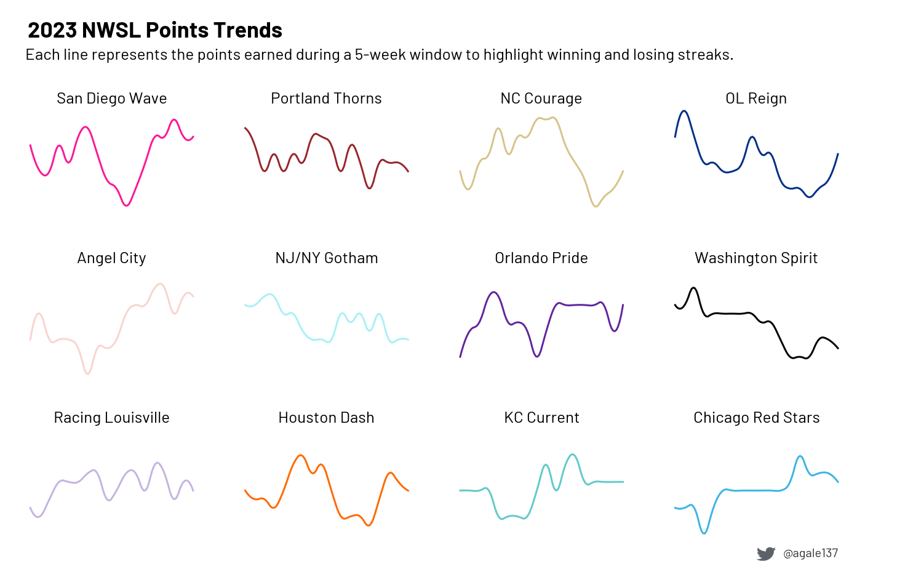

# Moving Window Points

The goal of this visualization is to understand momentum of each team and
when they were doing better or worse over the course of the season. Used
small multiples to show each plot separately, allowing you to see differences
between teams. A 5-game window is used for this example:

