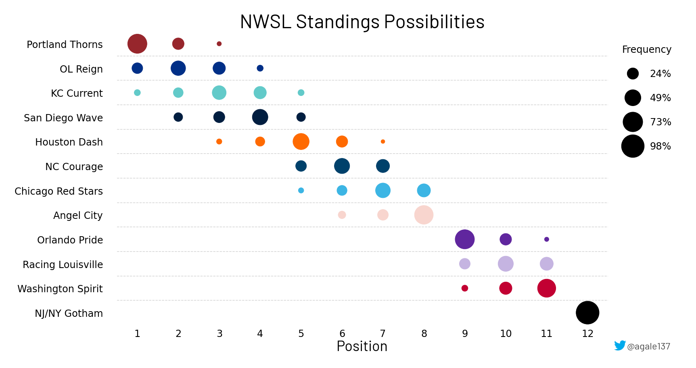

# Playoff possibilities

Exploring the possibility of enumerating all possible playoff outsomes to
see where teams might finish in the table. Due to the computational
complexity, this can only really be run before the last weekend of the
season.

Here is an example of what it might look like:

I also visualized what it would be like if there was a decision day:

