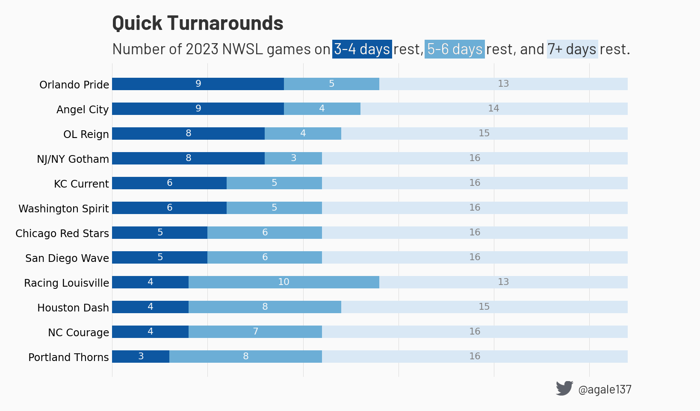

# Schedule infographics

## Gaps between games

The goal is to create a visualization of the distribution of rest periods
between games. In the 2022 season there were a few teams that had very
little rest while other teams had much more balanced schedules. This does
include Challenge Cup games.

Here is a visualization for the 2023 schedule.

