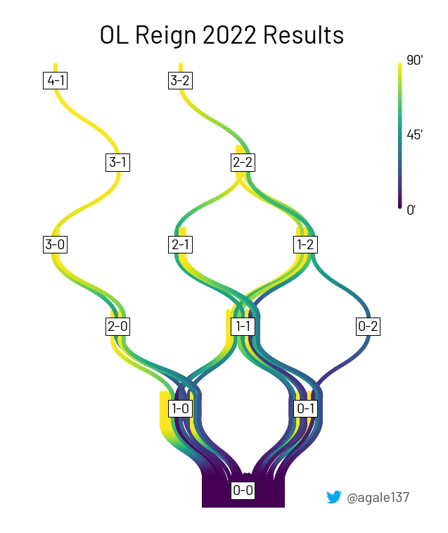

# Score waterfall

This visualization shows how the goals progressed for a given set of games. The x axis is the goal differential and the y axis is the number of goals. The colors of the lines represent when the goal was scored during the game. This allows to see trends of goals being conceeded or scored early or late.

